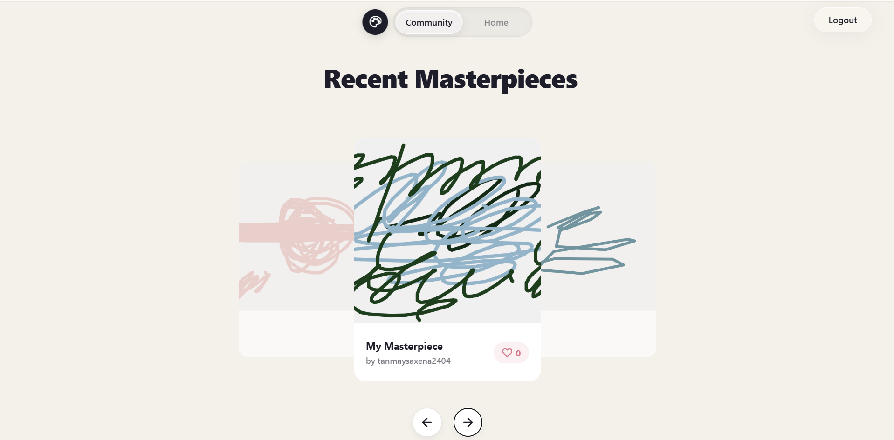
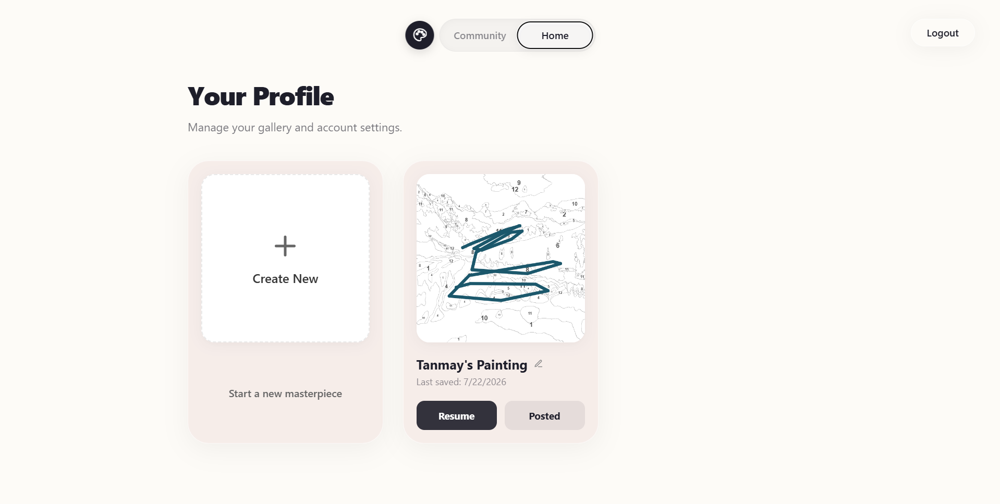

# 🎨 Paint-By-Numbers AI


Transform any photo into a stunning paint-by-numbers masterpiece instantly using AI. Paint-By-Numbers AI is a modern web application that allows users to create, paint, and share custom paint-by-numbers templates directly in their browser.

## ✨ Features

- **🪄 AI-Powered Generation:** Upload any image and our AI backend automatically generates a simplified paint-by-numbers template along with a custom color palette.
- **🖌️ Interactive Digital Canvas:** Paint your masterpiece directly in the browser with an intuitive, interactive digital canvas.
- **💾 Cloud Saving:** Your progress is automatically saved to the cloud. Pick up your brush exactly where you left off from any device.
- **🌍 Community Gallery:** Share your completed (or in-progress!) masterpieces with the community. Browse, vote, and get inspired by other artists' creations.
- **👤 User Profiles:** Manage your gallery, view your past projects, and edit your painting details.

## 📸 Screenshots

### Community: Inspiration Templates

*Find inspiration and start a new project from popular templates.*

### Community: Recent Masterpieces

*Browse and vote on beautiful artworks created by the community.*

### Your Profile & Gallery

*Manage your ongoing projects and track your artistic journey.*

## 🛠️ Tech Stack

- **Frontend:** React, TypeScript, React Router
- **Styling:** Vanilla CSS with modern glassmorphism & responsive design
- **Animations:** GSAP (GreenSock) for smooth carousel and UI animations
- **Backend & Auth:** Supabase (PostgreSQL, Row Level Security, Storage)
- **AI Processing:** Custom ML Python Backend

## 🚀 Getting Started

### Prerequisites
- Node.js (v16+)
- npm or yarn
- A Supabase Project

### Installation

1. **Clone the repository**
   ```bash
   git clone https://github.com/Tanmay240405/Paint-By-Number-web.git
   cd Paint-By-Number-web
   ```

2. **Install dependencies**
   ```bash
   npm install
   ```

3. **Set up Environment Variables**
   Create a `.env` file in the root directory and add your Supabase and ML Backend credentials:
   ```env
   REACT_APP_SUPABASE_URL=your_supabase_url
   REACT_APP_SUPABASE_ANON_KEY=your_supabase_anon_key
   REACT_APP_ML_BACKEND_URL=your_ml_backend_url
   ```

4. **Start the development server**
   ```bash
   npm start
   ```
   The app will be running at [http://localhost:3000](http://localhost:3000).

## 🗄️ Database Schema

This project requires a specific Supabase schema with Row Level Security (RLS) policies. You can find the complete SQL setup script in [`supabase_schema.sql`](supabase_schema.sql). Run this script in your Supabase SQL Editor to initialize your database and storage buckets.
